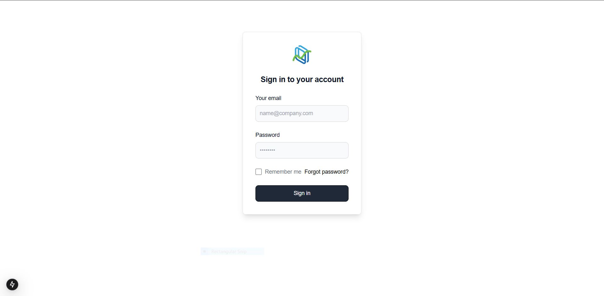
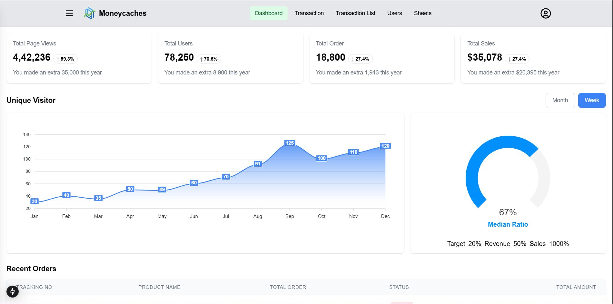
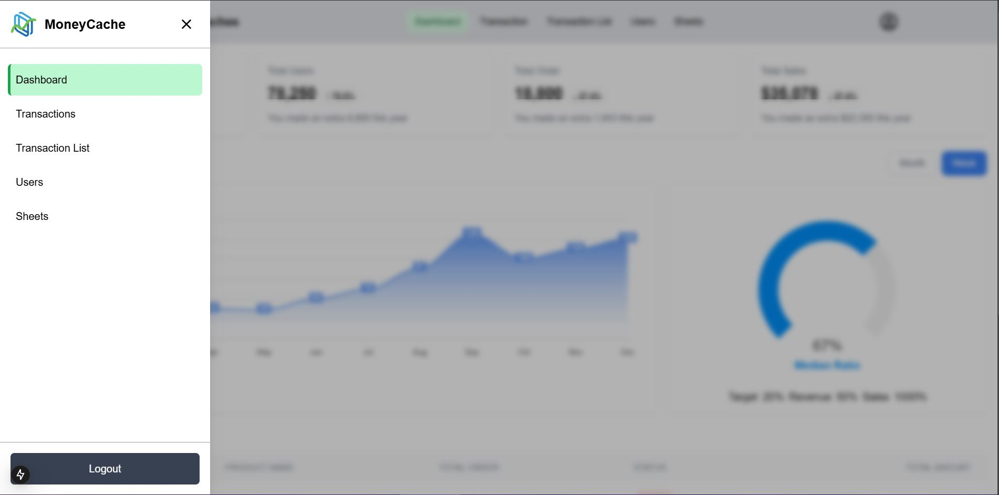
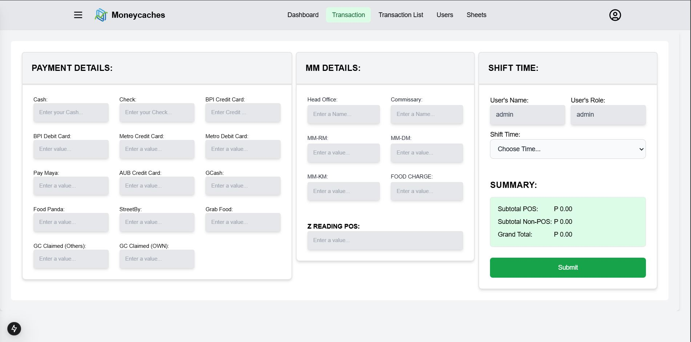
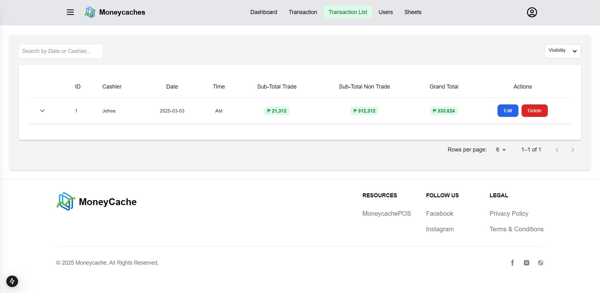
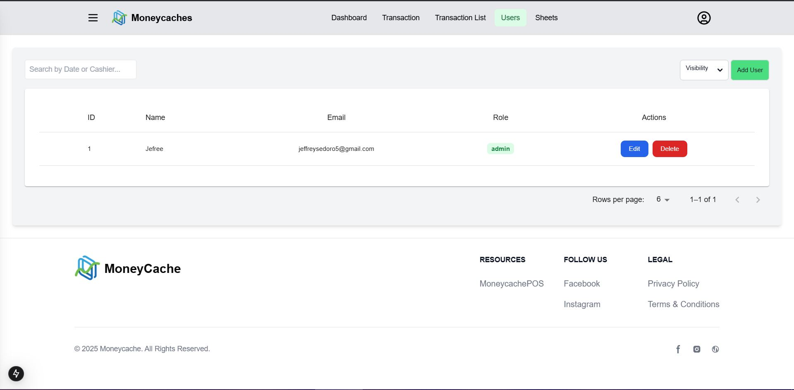
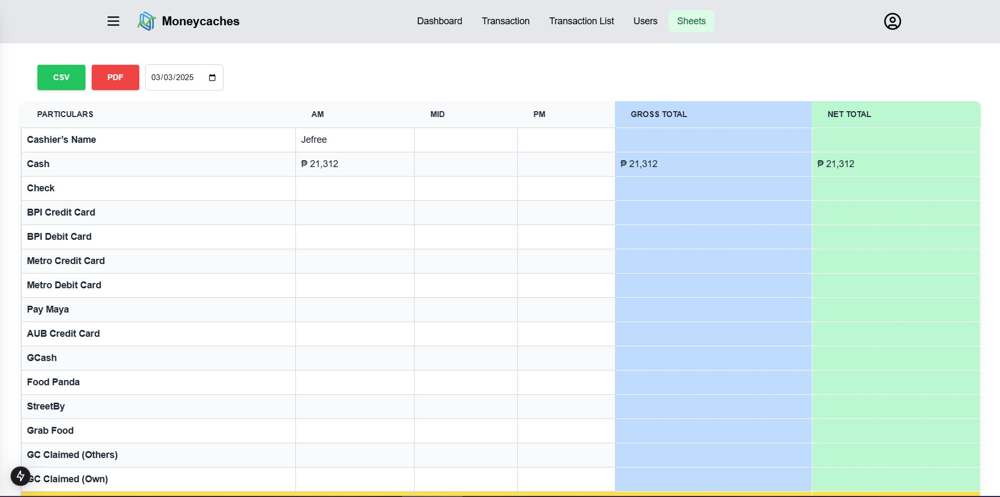

This is a [Next.js](https://nextjs.org) project bootstrapped with [`create-next-app`](https://nextjs.org/docs/app/api-reference/cli/create-next-app).

## Getting Started

### Must run main branch before Executing the code to connect The React FrontEnd and to the Backend Server

## On your Backend(Laravel)
# include the ff:

### Composer Installation
Installs all PHP dependencies listed in composer.json.
```bash
composer install
```

### NPM Installation
Installs dependencies needed for assets and components.
```bash
npm install
```

### NPM Build
Compiles and optimizes frontend assets for production.
```bash
npm run build
```

### APP_KEY Key Generate 
A command in Laravel generates a new APP_KEY in the .env file, which is used for encryption, session security, and password hashing. This key ensures secure data encryption and must be set before running the application. If changed after users have registered, encrypted data like passwords may become unreadable.
```bash
php artisan key:generate
```

### Passport:client --password 
The php artisan passport:client --password command in Laravel Passport creates a Password Grant Client, allowing users to authenticate using their email and password instead of OAuth redirection. In a Next.js frontend, you send a request to Laravel’s /oauth/token endpoint with the user's credentials to obtain an access token.
```bash
php artisan passport:client --password
```
## Passport Key Generate 
Used to create encryption keys within a Laravel application, specifically with the "Passport" package, which is essential for securely generating and managing access tokens for API authentication within your application
```bash
php artisan passport:keys
```

## On your Frontend(react_frontend)
# include the ff:

### NPM Installation
Installs dependencies needed for assets and components.
```bash
npm install
```

### Run Npm run dev
The npm run dev command in a Next.js frontend starts the development server, allowing you to run the application locally with features like hot reloading and fast refresh. By default, it runs on http://localhost:3000
```bash
npm run dev
```


Open [http://localhost:3000](http://localhost:3000) with your browser to see the result.


## Example Picture Output 









