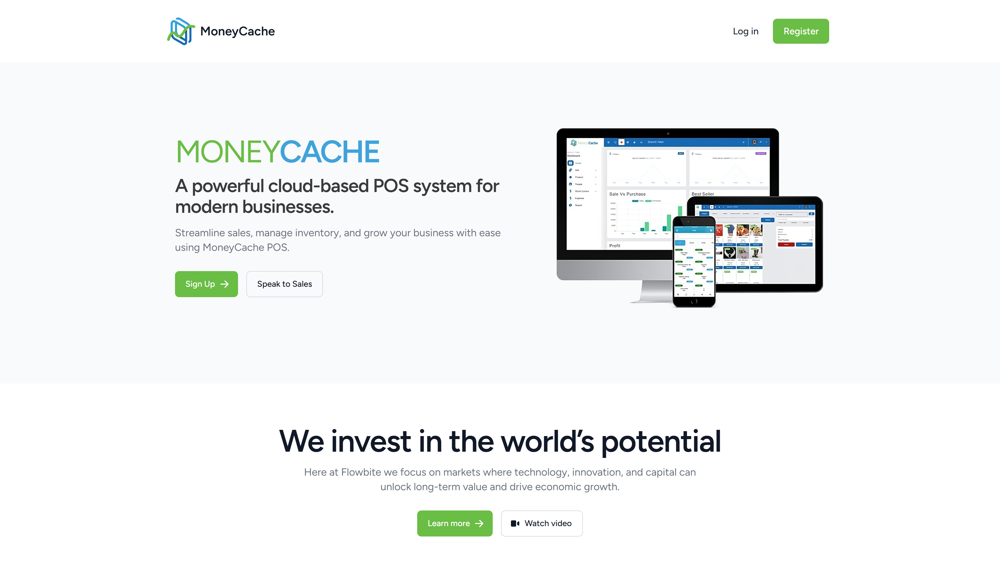
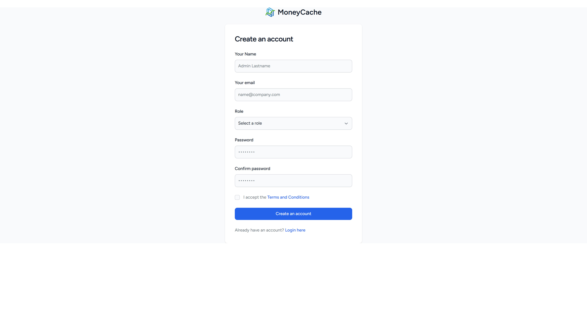
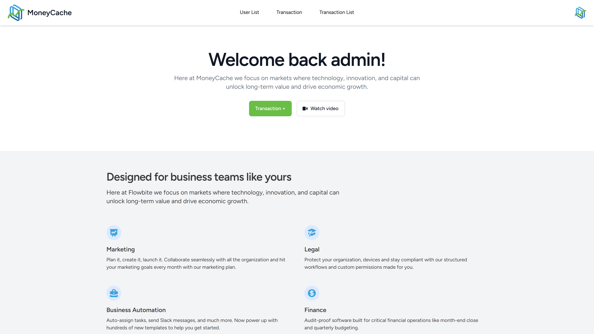
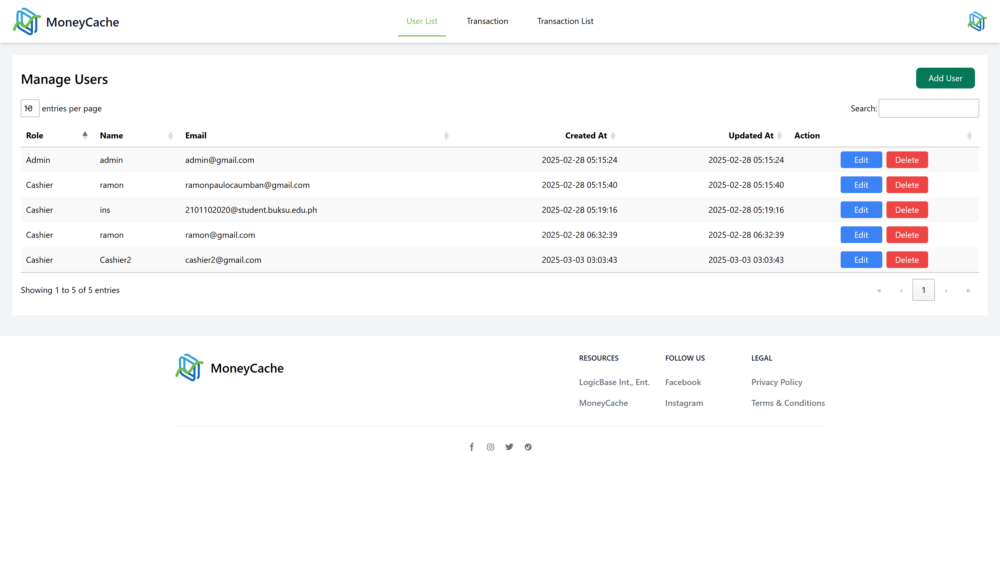
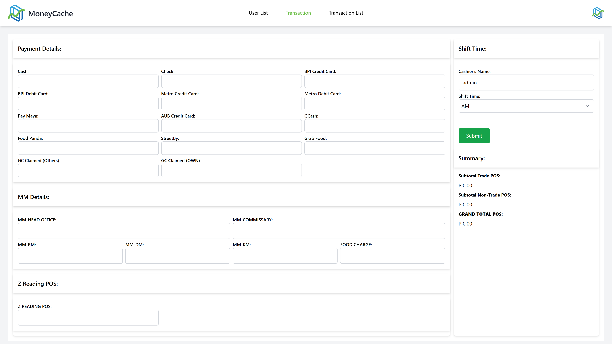
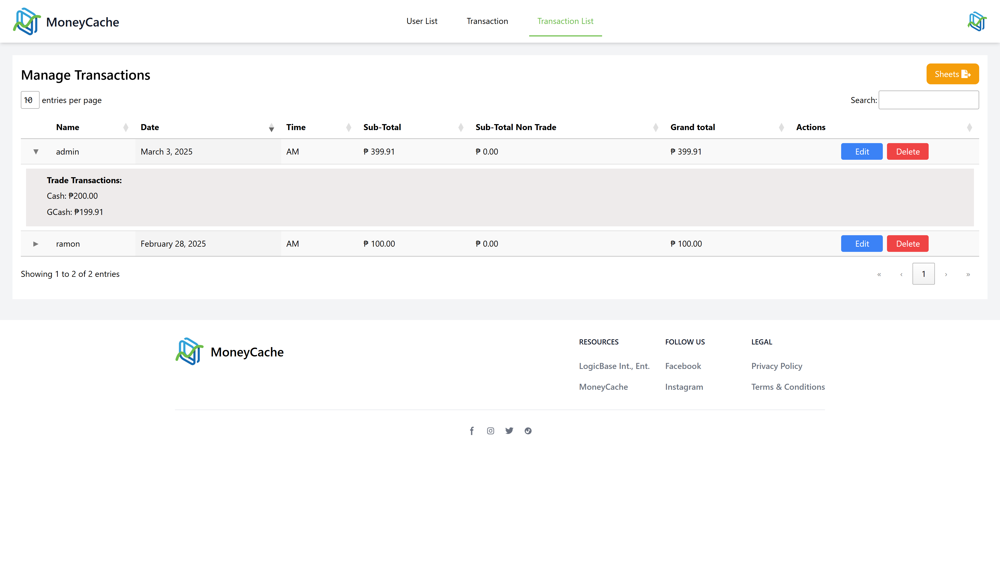
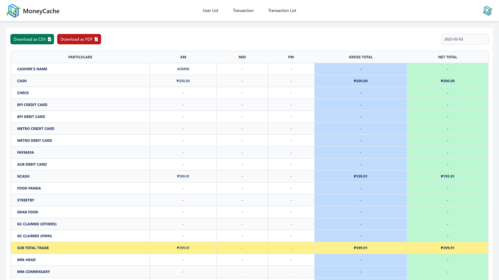

<p align="center"><a href="https://laravel.com" target="_blank"></a></p>

<p align="center">
<a href="https://github.com/laravel/framework/actions"></a>
<a href="https://packagist.org/packages/laravel/framework"></a>
<a href="https://packagist.org/packages/laravel/framework"></a>
<a href="https://packagist.org/packages/laravel/framework"></a>
</p>

## Execute Commands
Before starting the application, run the following commands to install dependencies and build assets properly. These steps ensure the project runs smoothly with the required packages.

### Composer Installation
Installs all PHP dependencies listed in composer.json.
```bash
composer install
```

### NPM Installation
Installs dependencies needed for assets and components.
```bash
npm install
```

### NPM Build
Compiles and optimizes frontend assets for production.
```bash
npm run build
```

### Configure Environment  
Laravel requires a `.env` file for database and app settings. If not already present, create one by copying the example file:  

```bash
cp .env.example .env
```

### App Key Generate 
The application key is used by Laravel for **encryption, securing sessions, and hashing passwords**.  
This key ensures that encrypted data (such as cookies and sensitive user information) remains secure.  

```bash
php artisan key:generate 
```
<!-- ### Passport Key Generate 
Key is used by Laravel for encryption, including hashing passwords, encrypting data, and securing sessions.
Compiles and optimizes frontend assets for production.
```bash
php artisan key:generate -->

### Run the Application 
After installing dependencies, start the application using:
```bash
composer run dev
```
This command runs the script defined in composer.json. Typically, it starts both:

- The Laravel backend server (php artisan serve)
- The Frontend build process (npm run dev for Vite or another tool)

### Open the Application 
Open your browser and type http://127.0.0.1:8000/ on the searchbar

## Screenshots

<div align="center">
  
</div>

<div align="center">
  
</div>

<div align="center">
  
</div>

<div align="center">
  
</div>

<div align="center">
  
</div>

<div align="center">
  
</div>

<div align="center">
  
</div>

## About Laravel

Laravel is a web application framework with expressive, elegant syntax. We believe development must be an enjoyable and creative experience to be truly fulfilling. Laravel takes the pain out of development by easing common tasks used in many web projects, such as:

- [Simple, fast routing engine](https://laravel.com/docs/routing).
- [Powerful dependency injection container](https://laravel.com/docs/container).
- Multiple back-ends for [session](https://laravel.com/docs/session) and [cache](https://laravel.com/docs/cache) storage.
- Expressive, intuitive [database ORM](https://laravel.com/docs/eloquent).
- Database agnostic [schema migrations](https://laravel.com/docs/migrations).
- [Robust background job processing](https://laravel.com/docs/queues).
- [Real-time event broadcasting](https://laravel.com/docs/broadcasting).

Laravel is accessible, powerful, and provides tools required for large, robust applications.

## Code of Conduct

In order to ensure that the Laravel community is welcoming to all, please review and abide by the [Code of Conduct](https://laravel.com/docs/contributions#code-of-conduct).

## Security Vulnerabilities

If you discover a security vulnerability within Laravel, please send an e-mail to Taylor Otwell via [taylor@laravel.com](mailto:taylor@laravel.com). All security vulnerabilities will be promptly addressed.

## License

The Laravel framework is open-sourced software licensed under the [MIT license](https://opensource.org/licenses/MIT).
